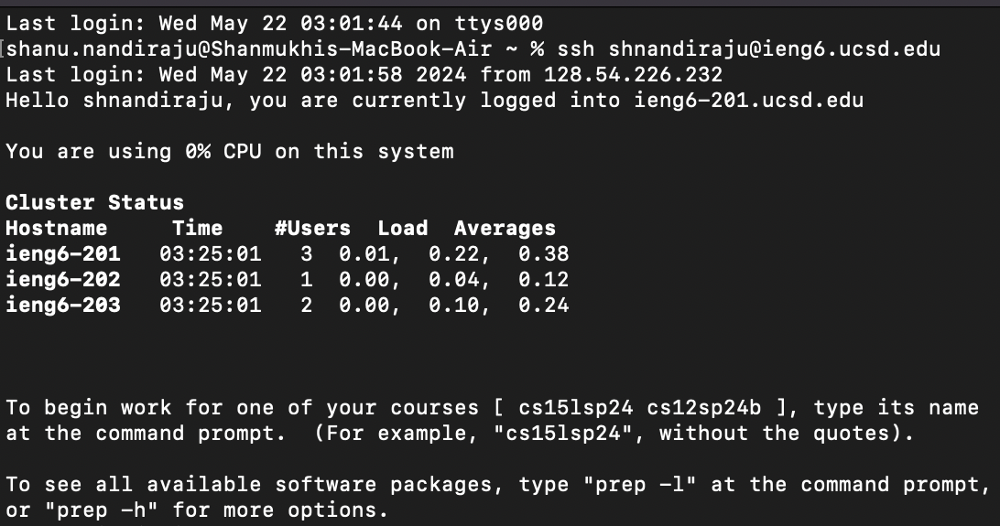
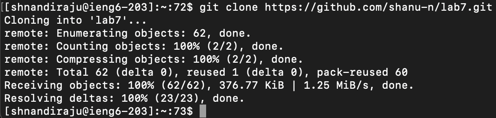
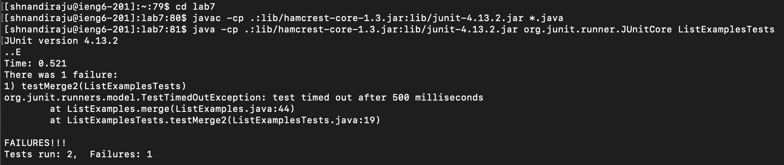
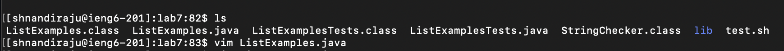
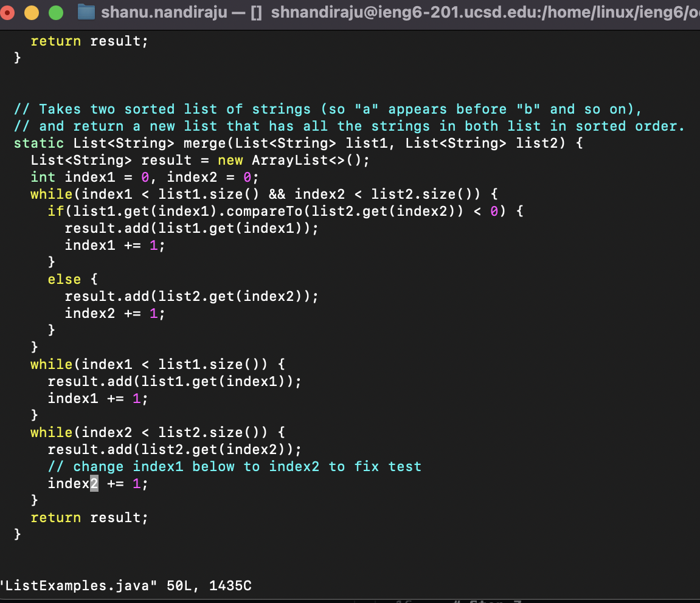
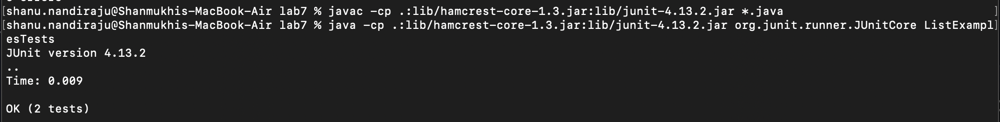
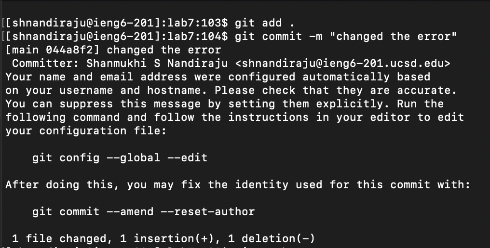
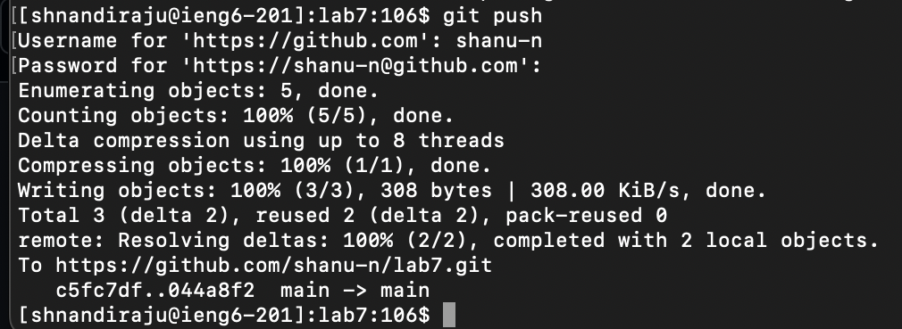

# Step 4:
## Command: `ssh <space> shnandiraju@ieng6.ucsd.edu <enter>`

`ssh` allowed me to connect to the remote server

# Step 5:
## Command: `git <space> clone <space> https://github.com/shanu-n/lab7.git <enter>`

`git clone` successfully cloned lab7's repository onto the remote server

# Step 6:
## Commands: `cd <space> lab7 <enter> CTRL+C CTRL+V <enter> CTRL+C CTRL+V ListExamplesTests <enter>`

`cd` allowed us to navigate to the lab7 directory and `CTRL+C CTRL+V` allowed me to copy paste `javac -cp .:lib/hamcrest-core-1.3.jar:lib/junit-4.13.2.jar *.java` and `java -cp .:lib/hamcrest-core-1.3.jar:lib/junit-4.13.2.jar org.junit.runner.JUnitCore` to terminal. These commands compiled the code then tried to run the code in the ListExamplesTests.java file, but since there were errors, it printed error messages to terminal

# Step 7:
## Commands: `ls <enter> vim <space> ListExamples.java <enter> <up><up><up><up><right><right><right><right><right><right><right><right><right><right><right><right> <i> <backspace> 2 <esc> :wq <enter>`

`ls` shows us the contents of the directory\
`vim ListExamples.java` opens `ListExamples.java` in the Vim text editor in normal mode\
`i` switches the mode to insert mode, allowing us to modify the text\
`<up <right>` allow us to move up and right through the lines of the file, till we get to `index1` and change it to `index2`\
`<esc>` exits insert mode\
`:wq` saves changes and exits vim, returning us to the terminal

# Step 8: 
## Commands: `<up><up><up><up> <enter> <up><up><up><up> <enter>`

`<up><up><up><up>` because the `javac -cp .:lib/hamcrest-core-1.3.jar:lib/junit-4.13.2.jar *.java` command was 4 up in the search history, then `<up><up><up><up>` again because `java -cp .:lib/hamcrest-core-1.3.jar:lib/junit-4.13.2.jar org.junit.runner.JUnitCore ListExamplesTests` command was 4 up in the history too.

# Step 9:
## Commands: `git <space> add  <space> . <enter> git <space> commit <space> -m <space> "changed the error" <enter> git <space> push <enter> <username> <enter> <personal access token> <enter>`

`git add .` adds all the changes\
`git commit -m "changed the error"` commits the changes and adds this message with the commit\
`git push` pushes the changes to the remote lab7 repo\
`<username> <personal access token>` are for authentication before pushing to remote repo.

