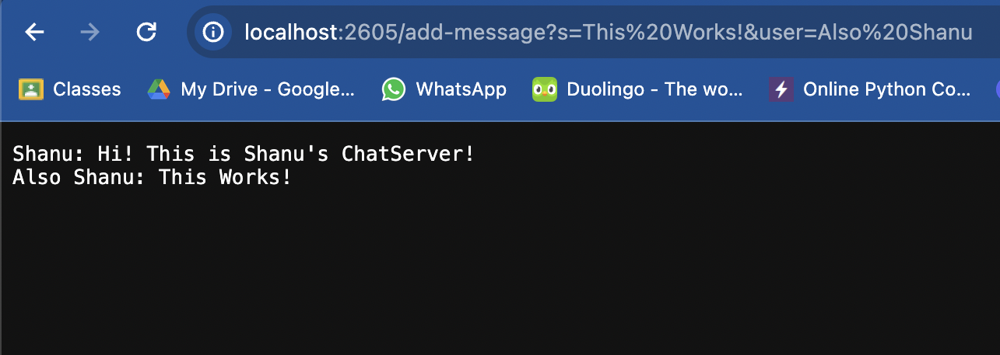
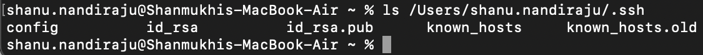
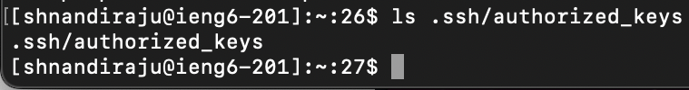
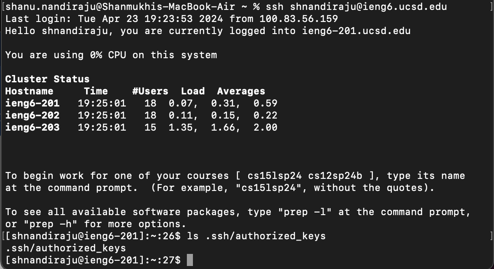

# Part 1: Making a ChatServer!

### 1. The Code: (Credited to Skill Demo 1's `StringServer.java` and wavelet's `NumberServer.java` folder downloaded from Week 2's lab)

____________________________________________________________________________________________________________________________________________________________________________________________
### 2. `/add-message` Example 1:

#### Which methods in your code are called?
In this example, the method `handleRequest` is being called.
#### What are the relevant arguments to those methods, and the values of any relevant fields of the class?
*The Relevant Arguments:* 
1. The URL (specifically the path an query)

*The Relevant Fields:*
1. `URI url`: This is the method’s only parameter, and it contains the URL of the page that we are using.
2. `StringBuilder builder`: An object of `StringBuilder` (a standard class in the `java.lang` package) which allows you to add different pieces of text together, which is used to build the final message.
3. `String[] parameters`: An array of strings used to store the split-up parts of the query part of the URL.
4. `String records`: A string variable which logs the conversations (each `/add-message` that happens) on the server.
#### How do the values of any relevant fields of the class change from this specific request? If no values got changed, explain why.
`StringBuilder builder`, `ArrayList<String> conversations`, and `String records` all change from this request. `StringBuilder builder` is initialized as an empty object, and then it is appended to, so it changes. The ArrayList that is not in the method but within the class, `ArrayList<String> conversations`, stores the messages in parts, so it also changes from being empty to containing the chat that is appended to it. `String records` stores all the messages from `conversations` as a single string, and as of now, it has one chat: 

`Shanu: Hi! This is Shanu's ChatServer!`

So it also changed.
____________________________________________________________________________________________________________________________________________________________________________________________
### 3. `/add-message` Example 2:

#### Which methods in your code are called?
In this example, the method `handleRequest` is being called.
#### What are the relevant arguments to those methods, and the values of any relevant fields of the class?
*The Relevant Arguments:* 
1. The URL (specifically the path an query)

*The Relevant Fields:*
1. `URI url`: This is the method’s only parameter, and it contains the URL of the page that we are using.
2. `StringBuilder builder`: An object of `StringBuilder` (a standard class in the `java.lang` package) which allows you to add different pieces of text together, which is used to build the final message.
3. `String[] parameters`: An array of strings used to store the split-up parts of the query part of the URL.
4. `String records`: A string variable which logs the conversations (each `/add-message` that happens) on the server.
#### How do the values of any relevant fields of the class change from this specific request? If no values got changed, explain why.
`StringBuilder builder`, `ArrayList<String> conversations`, and `String records` all change from this request. `StringBuilder builder` is initialized as an empty object, and then it is appended to, so it changes. The ArrayList that is not in the method but within the class, `ArrayList<String> conversations`, stores the messages in parts, so it also changes from containing only the first chat to containing the new one as well. `String records` stores all the messages from `conversations` as a single string, so now it has 2 chats:

`Shanu: Hi! This is Shanu's ChatServer!`\
`Also Shanu: This works!`

So, this also changes.
____________________________________________________________________________________________________________________________________________________________________________________________

# Part 2: Command Line

### 1. On the command line of your computer, run `ls` with the absolute path to the private key for your SSH key for logging into ieng6.

### 2. On the command line of the ieng6 machine, run `ls` with the absolute path to the public key for your SSH key for logging into ieng6 (this is the one you copied to your account on ieng6 using ssh-copy-id, so it should be a path on ieng6's file system).

### 3. A terminal interaction where you log into your ieng6 account without being asked for a password.

____________________________________________________________________________________________________________________________________________________________________________________________

# Part 3: Some things I learned from Weeks 2 and 3

Everything we learned in classes and labs about terminal commands and accessing remote servers was new to me, so I learned a lot. I learned, specifically, how to clone and make repositories, GitHub pages, how to edit and commit changes in GitHub, how to use various terminal commands including `ls` `cd` `pwd` `cat`, `echo`, and more! I also learned a little bit about shells and bash and what those are from lectures.

