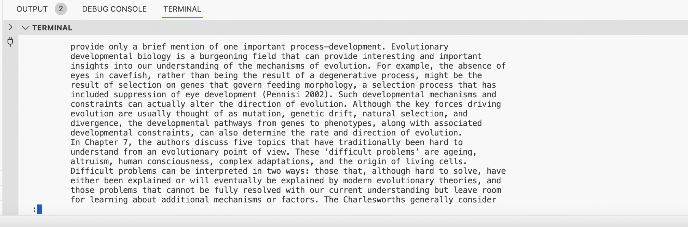

# Part 1 - Bugs

## The program has a bug in the `reverseInPlace` method found in ArrayExamples.java:
```
static void reverseInPlace(int[] arr) {
    for(int i = 0; i < arr.length; i += 1) {
      arr[i] = arr[arr.length - i - 1];
    }
  }
```

## A failure-inducing input for the buggy program, as a JUnit test and any associated code (write it as a code block in Markdown).
```
@Test
  public void testReverseInPlace1() {
  int[] input1 = {2, 4, 6, 8};
  ArrayExamples.reverseInPlace(input1);
  assertArrayEquals(new int[]{8, 6, 4, 2}, input1);
  }
```
## An input that doesn't induce a failure, as a JUnit test and any associated code (write it as a code block in Markdown).
```
@Test
  public void testReverseInPlace2() {
  int[] input1 = {10};
  ArrayExamples.reverseInPlace(input1);
  assertArrayEquals(new int[]{10}, input1);
  }
```
## The symptom, as the output of running the two tests above (provide it as a screenshot -- one test should pass, one test should fail).


## The bug, as the before-and-after code change required to fix it (as two code blocks in Markdown).

### Before the bug is fixed:\n
```
static void reverseInPlace(int[] arr) {
    for(int i = 0; i < arr.length; i += 1) {
      arr[i] = arr[arr.length - i - 1];
    }
  }
```

### After the bug is fixed:\n
```
static void reverseInPlace(int[] arr) {
  for (int i = 0; i < arr.length / 2; i++) {
    int temp = arr[i];
    arr[i] = arr[arr.length - i - 1];
    arr[arr.length - i - 1] = temp;
  }
}
```

## Briefly describe (2-3 sentences) why the fix addresses the issue.

The issue was the line `arr[i] = arr[arr.length - i - 1];`, because it replaced the value in the array at position `i` with the value from the end of the array, which unintentionally ends up erasing the original value of `arr[i]`. This leads to the loss of that value from the array/incorrect swapping; My fix used a temporary variable `temp` that held the value of `arr[i]` before the swap, so it can be accessed again after the assignment of `arr[arr.length - i - 1]` to `arr[i]`. `temp` is then assigned to `arr[arr.length - i - 1]`, which correctly swaps the 2 values and hence reverses the array in its place.

_______________________________________________________________________________________________________________________________________________________________________________________________________________________________________________________________

# Part 2 - Researching Commands

## The command I picked is `less`. The 4 interesting command-line options I want to test are: `-N`, `-i`, `+/<pattern>`, and `-S`

- `-N` will display line numbers while you are viewing a file
- `-i` will find and show all occurrences of the term (regardless of whether the case matched) in the file
- `+/<pattern>` will start the `less` command after it finds the first occurrence of the pattern I enter into the parameter in the file
- `h <number>` configures the number of lines shown simultaneously from my file, using my provided number as the parameter

_______________________________________________________________________________________________________________________________________________________________________________________________________________________________________________________________

## `less -N filename` in `./technical`:

### Example 1: 

Command: `less -N ./technical/plos/journal.pbio.0020071.txt`

Output: 

Description: the `-N` command-line option allows me to see the file contents ALONG WITH the line numbers in the file `journal.pbio.0020071.txt` located in the `plos` directory within the `technical` directory. Content display is done via `less`, and content line numbers is done via `-N` (shown on the left side of my terminal screen, allowing me to see which line i'm reading in the file contents).


### Example 2:

Command: `less -N ./technical/911report/preface.txt`

Output: 

Description: the `-N` command-line option allows me to see the file contents ALONG WITH the line numbers in the file `preface.txt` located in the `911report` directory within the `technical` directory. Content display is done via `less`, and content line numbers is done via `-N` (shown on the left side of my terminal screen, allowing me to see which line i'm reading in the file contents).

`-N` Command Source: ChatGPT

_______________________________________________________________________________________________________________________________________________________________________________________________________________________________________________________________

## `less -i filename` in `./technical`:

### Example 1: 

Command: `less -i ./technical/plos/journal.pbio.0020071.txt`

Output: 

Description: the `-i` command-line option allows me to see my searchword in the file contents of `journal.pbio.0020071.txt` located in the `plos` directory within the `technical` directory. Content display is done via `less`, and the highlighting of my case-insensitive word (can be entered in any case and it will still find it) is done by `-i` (shown in grey highlighted text).


### Example 2:

Command: `less -i ./technical/911report/preface.txt`

Output: 

Description: the `-i` command-line option allows me to see my searchword in the file contents of `preface.txt` located in the `911report` directory within the `technical` directory. Content display is done via `less`, and the highlighting of my case-insensitive word (can be entered in lowercase and it will still find it) is done by `-i` (shown in grey highlighted text).

`-i` Command Source: ChatGPT

_______________________________________________________________________________________________________________________________________________________________________________________________________________________________________________________________

## `less +/<pattern> filename` in `./technical`:

### Example 1: 

Command: `less +/Although ./technical/plos/journal.pbio.0020071.txt`

Output: 

Description: the `less +/Although` command-line option allows me to see my file's contents starting with the searchword (`Although`) in `journal.pbio.0020071.txt` located in the `plos` directory within the `technical` directory. Content display is done via `less`, and seeing the content from the location of my searchword is done by `less +/Although`.


### Example 2:

Command: `less +/other ./technical/911report/preface.txt`

Output: 

Description: the `less +/other` command-line option allows me to see my file's contents starting with the searchword (`other`) in `preface.txt` located in the `911report` directory within the `technical` directory. Content display is done via `less`, and seeing the content from the location of my searchword is done by `less +/other`.

`+/<pattern>` Command Source: `man less`

_______________________________________________________________________________________________________________________________________________________________________________________________________________________________________________________________


## `less filename` in `./technical` with `%<percent>` command:

### Example 1: 

Command: `less ./technical/plos/journal.pbio.0020071.txt`\n
Second Command once we enter `less`: `30%`.

Output: 

Description: the `less` command-line option allows me to see my file's contents and `30%` allows me to see 30% of the file `journal.pbio.0020071.txt` located in the `plos` directory within the `technical` directory. Content display is done via `less`, and seeing the content from the 30% mark of the file is done by `30%`.

### Example 2:

Command: `less ./technical/911report/preface.txt`\n
Second Command once we enter `less`: `70%`.

Output: 

Description: the `less` command-line option allows me to see my file's contents and `70%` allows me to see 30% of the file `preface.txt` located in the `911report` directory within the `technical` directory. Content display is done via `less`, and seeing the content from the 70% mark of the file is done by `70%`.

`%` Command Source: `man less`

_______________________________________________________________________________________________________________________________________________________________________________________________________________________________________________________________


## I used ChatGPT for this part of the assignment. Here are the prompts I gave ChatGPT:
1. find command-line options for `less`

## What its output was and how I changed the output after it was produced:
```
1. Here are some common command-line options for the less command:
  -N: Display line numbers.\n
  -i: Ignore case in searches.\n
  -S: Chop long lines (rather than wrapping them).\n
  -F: Quit if the entire file fits on one screen.\n
  -R: Display ANSI color escape sequences.\n
  -X: Clear the screen before displaying the file.\n
  +<number>: Start displaying the file at line number <number>.\n
  -h <number>: Set the number of lines displayed at a time.\n
  --version: Display version information.\n
These are just a few options; there are many more available. You can explore them further by checking the manual page (man less).
```

- I ended up using `man less` in terminal like it suggested, and discovered `+/<pattern>` and wanted to try it too.
