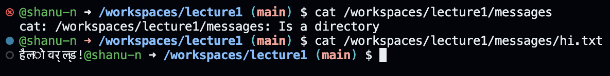

### Absolute path to the working directory right before command run: 
`/workspaces/lecture1`
### Why I got that output (What was in the filesystem, what it meant to have no arguments): 
There is no argument provided, so `cd` changes the current working directory to the home directory.
### Is this an error?
No, this is NOT an error.

### Absolute path to the working directory right before command run: 
`/workspaces/lecture1`
### Why I got that output (What was in the filesystem, what it meant to have no arguments): 
There was no output. That is an indication that `cd` successfully changed the working directory from the home directory to the "messages" directory. The path to the new directory was then `/workspaces/lecture1/messages`.
### Is this an error?
No, this is NOT an error.

### Absolute path to the working directory right before command run: 
`/workspaces/lecture1/messages`
### Why I got that output (What was in the filesystem, what it meant to have no arguments): 
I got this output because `cd` changes directories, and `/workspaces/lecture1/messages/hi.txt` does not point to a directory. So it cannot change directories based on the file path I gave it.
### Is this an error?
Yes, this IS an error. `cd` changes DIRECTORIES, and hi.txt is a TEXT FILE, *not* a directory. It does not contain any other files within it. It is simply a text file, so this command fails.

### Absolute path to the working directory right before command run: 
`/workspaces/lecture1`
### Why I got that output (What was in the filesystem, what it meant to have no arguments): 
I got this output because `ls` lists the contents currently located in the "lecture1" directory, and these were the files present there.
### Is this an error?
No, this is NOT an error.

### Absolute path to the working directory right before command run: 
`/workspaces/lecture1`
### Why I got that output (What was in the filesystem, what it meant to have no arguments): 
I got this output because `ls` now lists the contents/information located in the "messages" directory, which are the filenames stored in this directory. The tree structure for messages is:
`└── messages`\
    `├── en-us.txt`\
    `├── es-mx.txt`\
    `├── hi.txt`\
    `└── zh-cn.txt`\
### Is this an error?
No, this is NOT an error.
    

### Absolute path to the working directory right before command run: 
`/workspaces/lecture1`
### Why I got that output (What was in the filesystem, what it meant to have no arguments): 
I got this output because `ls` gives you information about the singular file "hi.txt" that isn't a directory and doesnt contain other files. It just prints the file path, confirming that it is present at the given location.
### Is this an error?
No, this is NOT an error.

### Absolute path to the working directory right before command run: 
`/workspaces/lecture1`
### Why I got that output (What was in the filesystem, what it meant to have no arguments): 
I got this empty output with a blinking cursor because `cat` expected me to enter arguments following it. Then, it waited for me to input something. Once I typed something and clicked enter, it just mirrored my input back to me. To exit this and move on with the assignment, I opened a new terminal.
### Is this an error?
No, I don't think this is an error. No error message was produced, it just waited for more user input.

### Absolute path to the working directory right before command run: 
`/workspaces/lecture1`
### Why I got that output (What was in the filesystem, what it meant to have no arguments): 
I got this output because the path `/workspaces/lecture1/messages` points to "messages", which is a directory. So `cd` cannot concatenate its contents and print to terminal because I did not give it access to any file data.
### Is this an error?
Yes, this IS an error. `cat` concatenates the contents of FILES and displayes them. So it expects one or more file names as arguments, but I gave it the directory "messages" instead. So it is just telling me that the error is that "messages" is a directory, not a file.

### Absolute path to the working directory right before command run: 
`/workspaces/lecture1`
### Why I got that output (What was in the filesystem, what it meant to have no arguments): 
I got this output because `cat` concatenates the contents of files and displays them, but I only gave it one file, "hi.txt". So it prints the contents of that file alone.
### Is this an error?
No, this is NOT an error.

  
