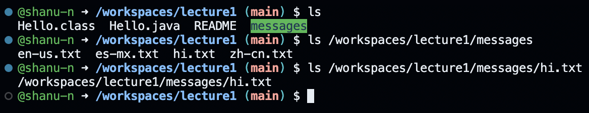
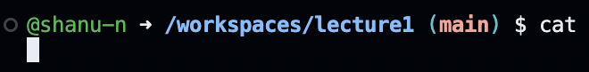

## Absolute path to the working directory right before command run: 
`/workspaces/lecture1`
## Why I got that output (What was in the filesystem, what it meant to have no arguments): 
There is no argument provided, so `cd` changes the current working directory to the home directory.

## Absolute path to the working directory right before command run: 
`/home/codespace`
## Why I got that output (What was in the filesystem, what it meant to have no arguments): 
There was no output. That is an indication that `cd` successfully changed the working directory from the home directory to the "messages" directory. The path to the new directory was then `/workspaces/lecture1/messages`.

## Absolute path to the working directory right before command run: 
`/workspaces/lecture1/messages`
## Why I got that output (What was in the filesystem, what it meant to have no arguments): 
I got this output because `cd` changes DIRECTORIES, and the text file hi.txt is *not* a directory. It does not contain any other files within it. It is simply a text file, so this command fails.

## Absolute path to the working directory right before command run: 
`/workspaces/lecture1`
## Why I got that output (What was in the filesystem, what it meant to have no arguments): 
I got this output because `ls` lists the contents currently located in the "lecture1" directory, and these were the files present there.

## Absolute path to the working directory right before command run: 
`/workspaces/lecture1`
## Why I got that output (What was in the filesystem, what it meant to have no arguments): 
I got this output because `ls` now lists the contents/information located in the "messages" directory, which are the filenames stored in this directory. The tree structure for messages is:
`└── messages
    ├── en-us.txt
    ├── es-mx.txt
    ├── hi.txt
    └── zh-cn.txt`
    

## Absolute path to the working directory right before command run: 
`/workspaces/lecture1`
## Why I got that output (What was in the filesystem, what it meant to have no arguments): 
I got this output because `ls` gives you information about the singular file "hi.txt" that isn't a directory and doesnt contain other files. It just prints the file path, confirming that it is present at the given location.

## Absolute path to the working directory right before command run: 
`/workspaces/lecture1`
## Why I got that output (What was in the filesystem, what it meant to have no arguments): 

  
